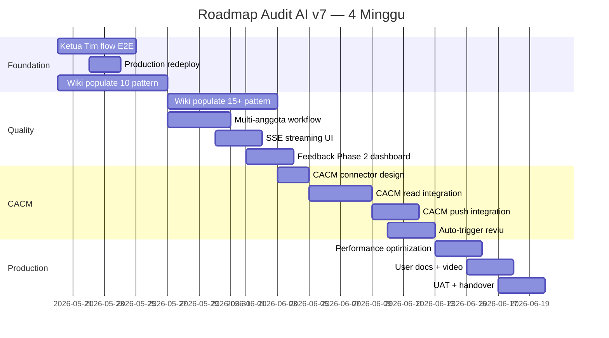
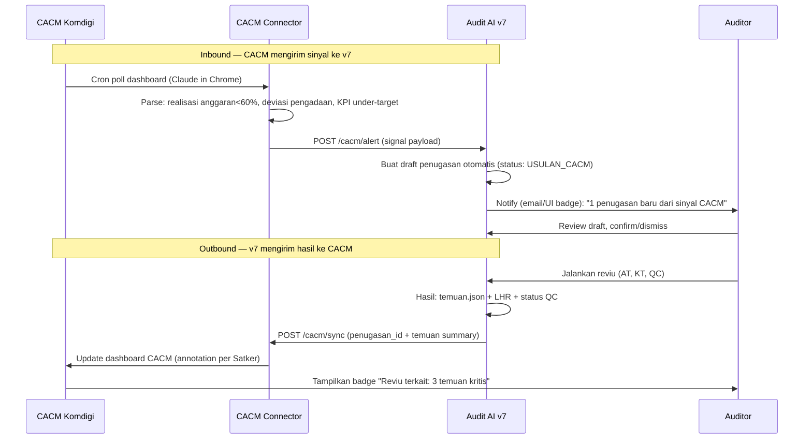

# Desain Proyek Audit AI v7 — Roadmap 1 Bulan

**Periode:** 20 Mei – 19 Juni 2026  
**Owner:** Inspektorat II Komdigi  
**Status dokumen:** Living document — di-update tiap akhir minggu  
**Lihat juga:** [README.md](README.md) (setup), [DEPLOY.md](DEPLOY.md) (deploy)

---

## 1. Ringkasan Eksekutif

Audit AI v7 saat ini sudah memiliki pipeline end-to-end yang berfungsi di dev lokal untuk **Reviu Pengadaan** dengan 4 agen Claude (Ingestion, Anggota Tim, QC SAIPI, Ketua Tim). Roadmap 4 minggu ini menyelesaikan **3 hal besar**:

1. **Closure pipeline** — Ketua Tim flow end-to-end + production deploy yang benar
2. **Wiki populate** — knowledge base 25+ pattern temuan agar agen konsisten dengan gaya tim
3. **CACM integration** — sistem audit AI menerima sinyal dari Continuous Auditing & Continuous Monitoring Komdigi untuk proaktif jadwalkan reviu

Hasil akhir: sistem siap dipakai produksi untuk 2 skill (Reviu RKA-K/L + Reviu Pengadaan) dengan loop perbaikan iteratif lewat feedback agen + auditor.

---

## 2. Kondisi Saat Ini (20 Mei 2026)

### Apa yang sudah jalan

| Area | Status | Catatan |
|------|--------|---------|
| Dev environment lokal | ✅ Stable | Setup gotcha didokumentasikan di README |
| 4 agen Claude hardened | ✅ Stable | tools=[], strict prompt, MCP-only access |
| Pipeline V6 reviu-pengadaan | ✅ Jalan E2E | 39 tool calls per run, QC PASS |
| Pipeline V6 reviu-rka-kl | ✅ Jalan E2E | Via bridge staging (`_stage_rka_inputs`); 4/4 RO sukses, 25 anomali, LHR ter-render dengan dummy-test-docs RKA |
| File output access (UI) | ✅ Stable | Tab Output & QC dengan download + preview |
| Auto-ingestion on upload | ✅ Stable | BackgroundTask di POST `/dokumen` |
| Wiki pattern library | ✅ Infrastruktur siap | Hanya 2 pattern contoh (RP-08, RKA-01) |
| Feedback loop Phase 1 | ✅ Stable | File JSON per run, visible di Output tab |
| Backend deploy Fly.io | ⚠️ Deployed tapi AI belum jalan | Dockerfile baru perlu push |
| Frontend deploy Vercel | ✅ Stable | URL: audit-ai-v7.vercel.app |

### Yang masih kosong / blocker

1. **Alur Ketua Tim belum ada** — sasaran-assignment.json + context.md tujuan/tim masih harus diisi manual oleh auditor
2. **Production AI tidak jalan** — image Fly.io belum di-rebuild dengan Dockerfile + dependency baru (Node.js + claude-code CLI + claude-agent-sdk 0.1.81 + pydantic 2.11.10)
3. **CACM integration belum ada** — Komdigi sudah punya sistem CACM (Continuous Auditing & Continuous Monitoring), tapi v7 belum bisa konsumsi/push data ke sana
4. **Wiki kosong** — hanya 2 contoh pattern, butuh 25+ untuk realistis menutup skill yang ada

---

## 3. Tujuan 1 Bulan

| Tujuan | Indikator Sukses |
|--------|------------------|
| **T1.** Pipeline reviu lengkap (AT + KT) jalan tanpa intervensi manual | Auditor cukup buat penugasan, upload dokumen, lalu klik "Jalankan Pipeline Otomatis" → output siap KKP + LHR + laporan QC |
| **T2.** Wiki menjadi rujukan riil tim | 25+ pattern temuan terisi, 80% temuan agen mengacu ke pattern wiki |
| **T3.** CACM sync 2 arah | (a) v7 baca alert CACM → proaktif buat penugasan; (b) hasil reviu v7 di-push balik ke CACM sebagai annotation |
| **T4.** Production ready | 1 reviu real end-to-end di Fly.io + Vercel tanpa fallback ke lokal. Time-to-result < 10 menit per penugasan |
| **T5.** Loop perbaikan jalan | Feedback agen di-review mingguan, minimal 3 pattern baru dari pattern_suggestions |

---

## 4. Roadmap Week-by-Week



### Minggu 1 (20–26 Mei): Foundation Completion

**Tema:** Tutup gap Tier 1 yang tersisa. Siapkan production yang stabil.

#### Deliverables

| ID | Item | Owner | Estimasi |
|----|------|-------|----------|
| W1.1 | Agen Ketua Tim ekstrak sasaran dari ST/PKP + UI tab "Setup Penugasan" | Dev | 3 hari |
| W1.2 | Multi-step KT flow: assign sasaran → konfirmasi auditor → write sasaran-assignment.json | Dev | 1 hari |
| W1.3 | Redeploy backend ke Fly.io dengan Dockerfile + deps baru, verify AI jalan | DevOps | 1 hari |
| W1.4 | Wiki populate: 5 pattern reviu-pengadaan + 5 pattern reviu-rka-kl | Auditor + Dev | 4 hari (paralel) |
| W1.5 | Test E2E reviu-rka-kl dengan dokumen nyata (1 penugasan DIT. Pengendalian) | Auditor + Dev | 1 hari |

#### Acceptance criteria

- KT bisa login, pilih penugasan, klik "Setup Sasaran" → agen baca ST/PKP dari `_INGESTED/`, ekstrak draft sasaran → KT review → confirm → `sasaran-assignment.json` ter-tulis
- Production URL `audit-ai-v7.fly.dev/health` return ok; `claude --version` di container working
- 10 file pattern di-merge ke `wiki/temuan-patterns/{skill}/`, README per skill di-update
- Reviu RKA-K/L 1 penugasan selesai E2E tanpa improvisasi agen

---

### Minggu 2 (27 Mei – 2 Juni): Quality & Scale

**Tema:** Tingkatkan kualitas output + UX. Persiapkan untuk multi-user.

#### Deliverables

| ID | Item | Owner | Estimasi |
|----|------|-------|----------|
| W2.1 | Wiki populate: 8 pattern reviu-pengadaan + 7 pattern reviu-rka-kl (total ≥25) | Auditor | 5 hari |
| W2.2 | Multi-anggota tim workflow: 1 penugasan punya 2+ anggota, masing-masing isi KKP terpisah | Dev | 3 hari |
| W2.3 | SSE streaming UI: ganti `runAgent` sync dengan EventSource → text/tool_use real-time di chat | Dev | 3 hari |
| W2.4 | Dashboard feedback aggregate: route `/feedback` yang scan semua `_FEEDBACK-AGEN/*.json` cross-penugasan, tampilkan top issues + pattern suggestions | Dev | 3 hari |
| W2.5 | Hydration warning fix di frontend dashboard | Dev | 0.5 hari |
| W2.6 | Persist agent run history per penugasan (sudah ter-store di DB, perlu UI "Riwayat") | Dev | 1 hari |

#### Acceptance criteria

- Wiki total 27+ pattern, masing-masing skill ≥12
- Skenario "2 anggota tim, 4 sasaran" jalan: masing-masing AT isi 2 sasaran, KT combine + render LHR
- Chat AT tampilkan tool calls + text token-by-token saat agen jalan (tidak nunggu sampai selesai)
- `/feedback` dashboard tampilkan: total feedback 30 hari terakhir, top 5 workflow issues, top 5 pattern suggestions, severity heatmap

---

### Minggu 3 (3 – 9 Juni): CACM Integration

**Tema:** Connect v7 ke sistem Continuous Auditing & Continuous Monitoring (CACM) yang sudah ada di Komdigi.

#### Design CACM Integration



#### Deliverables

| ID | Item | Owner | Estimasi |
|----|------|-------|----------|
| W3.1 | Design dokumen CACM integration (payload schema, auth, frekuensi sync, error handling) | Dev + Auditor | 2 hari |
| W3.2 | CACM read connector — module Python yang query CACM via Claude in Chrome (pakai logic dari skill ews-cacm-komdigi) → return signal terstruktur | Dev | 3 hari |
| W3.3 | Backend endpoint `POST /cacm/alert` — terima signal CACM, buat draft Penugasan dengan status `USULAN_CACM` | Dev | 1 hari |
| W3.4 | Frontend: badge "Usulan dari CACM" di list penugasan + tab review/dismiss | Dev | 2 hari |
| W3.5 | CACM push: endpoint `POST /cacm/sync` yang kirim hasil reviu balik ke CACM annotation | Dev | 2 hari |
| W3.6 | Scheduled task: tiap pagi 06:00 poll CACM → check alert baru → auto-create penugasan | Dev | 1 hari |
| W3.7 | Auditor training session: cara handle penugasan dari CACM vs penugasan manual | Auditor | 0.5 hari |

#### Acceptance criteria

- Skenario "CACM tampilkan realisasi anggaran Satker X < 60% di Q1" → v7 otomatis buat penugasan "Reviu Kinerja Realisasi Anggaran Satker X" → muncul di UI dengan badge
- Auditor accept usulan → run pipeline → hasil reviu di-push balik ke CACM, terlihat di dashboard CACM sebagai annotation per Satker
- Tidak ada signal CACM yang hilang dalam 7 hari berturut-turut

#### Trade-off & Risiko CACM

- **CACM tidak punya API resmi** → terpaksa scrape via Claude in Chrome. Fragile bila layout CACM berubah. Mitigasi: monitoring + alert kalau scrape error 2x berturut-turut
- **Auth** → user perlu login manual di Chrome sebelum scheduled task. Mitigasi: dokumentasi tetap login, monitor cookie expiry
- **Rate limit** → polling tiap pagi cukup, tidak realtime. CACM bukan high-frequency event source

---

### Minggu 4 (10 – 19 Juni): Production Hardening & Handover

**Tema:** Performansi, dokumentasi, transfer pengetahuan ke tim.

#### Deliverables

| ID | Item | Owner | Estimasi |
|----|------|-------|----------|
| W4.1 | Performance optimization: caching `list_temuan_patterns` per request, parallel `read_pdf_page` per anomali, debounce ingestion task | Dev | 3 hari |
| W4.2 | Backup/restore SOP: pg_dump scheduler Fly + restore script + test recovery | Dev/Ops | 1 hari |
| W4.3 | Monitoring: setup budget alert Anthropic (USD 5/hari) + Fly (USD 10/bln) | Ops | 0.5 hari |
| W4.4 | User documentation: panduan auditor (PDF + video screen-record 15 mnt) | Auditor + Dev | 3 hari |
| W4.5 | Wiki best-practices: 1-hari workshop dengan tim reviu, finalize struktur folder + tagging | Auditor | 1 hari |
| W4.6 | UAT — 3 penugasan real (1 reviu-pengadaan, 1 reviu-rka-kl, 1 dari CACM auto) | Auditor + Dev | 2 hari |
| W4.7 | Handover meeting + final ROADMAP retrospective | Semua | 0.5 hari |

#### Acceptance criteria

- Time-to-result < 10 menit per penugasan (dari klik "Jalankan" sampai laporan ready)
- Backup Postgres harian, restore time < 30 menit
- Dokumentasi auditor + video tersedia di internal portal
- 3 penugasan UAT lulus tanpa intervensi developer

---

## 5. Wiki Development Plan

### Status saat ini

- 2 pattern contoh: RP-08 (reviu-pengadaan), RKA-01 (reviu-rka-kl)
- Infrastruktur: `list_temuan_patterns` + `get_temuan_pattern` MCP tool sudah jalan

### Target akhir bulan: 25+ pattern

#### Reviu Pengadaan (target 13 pattern)

| ID | Judul (rencana) | Kategori | Severity | Status |
|----|------|----------|----------|--------|
| RP-01 | KAK Tidak Memuat SLA Terukur | PBJ-KAK | HIGH | ⏳ Week 1 |
| RP-02 | KAK Mencantumkan Beberapa Metode Pemilihan | PBJ-METODE | MEDIUM | ⏳ Week 1 |
| RP-03 | Spesifikasi Teknis KAK Mengarah ke Satu Brand | PBJ-KAK | HIGH | ⏳ Week 1 |
| RP-04 | KAK Tidak Memuat Jadwal Pelaksanaan Terinci | PBJ-KAK | MEDIUM | ⏳ Week 2 |
| RP-05 | HPS Tidak Mencantumkan Dasar Perpres 12/2021 | PBJ-HPS | MEDIUM | ⏳ Week 1 |
| RP-06 | HPS Merujuk SBM TA Sebelumnya | PBJ-HPS | MEDIUM | ⏳ Week 1 |
| RP-07 | HPS Inkonsisten dengan Spesifikasi KAK | PBJ-TRACEABILITY | HIGH | ⏳ Week 2 |
| RP-08 | HPS Tidak Didukung Minimum 2 Sumber Harga | PBJ-HPS | CRITICAL | ✅ Done |
| RP-09 | RFI Lewat Masa Berlaku Penawaran | PBJ-RFI | MEDIUM | ⏳ Week 2 |
| RP-10 | RFI dari Vendor Anak Perusahaan Sama | PBJ-RFI | HIGH | ⏳ Week 2 |
| RP-11 | Kontrak Tidak Memuat Pasal Denda SLA | PBJ-KONTRAK | HIGH | ⏳ Week 2 |
| RP-12 | Nilai Kontrak > 80% HPS Tanpa Justifikasi | PBJ-KONTRAK | MEDIUM | ⏳ Week 2 |
| RP-13 | Jangka Waktu Kontrak Inkonsisten KAK ↔ Kontrak | PBJ-TRACEABILITY | MEDIUM | ⏳ Week 2 |

#### Reviu RKA-K/L (target 13 pattern)

| ID | Judul (rencana) | Kategori | Severity | Status |
|----|------|----------|----------|--------|
| RKA-01 | TOR Tidak Memuat 7 Blok Substansi | RKA-TOR | HIGH | ✅ Done |
| RKA-02 | Indikator Kinerja TOR Tidak Terukur | RKA-TOR | HIGH | ⏳ Week 1 |
| RKA-03 | RAB Tidak Konsisten dengan TOR | RKA-CASCADING | HIGH | ⏳ Week 1 |
| RKA-04 | Akun Belanja RAB Tidak Sesuai BAS | RKA-RAB | MEDIUM | ⏳ Week 1 |
| RKA-05 | SBM Lewat Tahun Anggaran | RKA-SBM | MEDIUM | ⏳ Week 1 |
| RKA-06 | Honorarium di Atas Plafon SBM | RKA-SBM | HIGH | ⏳ Week 2 |
| RKA-07 | Belanja Perjalanan Dinas Tidak Wajar | RKA-RAB | MEDIUM | ⏳ Week 2 |
| RKA-08 | Cascading Output ke Komponen Tidak Konsisten | RKA-CASCADING | HIGH | ⏳ Week 2 |
| RKA-09 | Penandaan Output Tidak Sesuai Renstra | RKA-PENANDAAN | LOW | ⏳ Week 2 |
| RKA-10 | KPI Tidak Selaras dengan RO | RKA-KPI | HIGH | ⏳ Week 2 |
| RKA-11 | Anggaran Konsultan Tanpa TOR Terlampir | RKA-RAB | MEDIUM | ⏳ Week 2 |
| RKA-12 | RAB Sosialisasi/FGD Tanpa Output Konkret | RKA-RAB | LOW | ⏳ Week 2 |
| RKA-13 | Anggaran Operasional Lebih dari 30% Total | RKA-RAB | MEDIUM | ⏳ Week 2 |

### Workflow populate pattern

1. **Identifikasi** — auditor seniors tarik temuan top dari LHR historis 2024–2025
2. **Drafting** — auditor tulis pattern di template `.md` dengan YAML frontmatter
3. **Review** — Pengendali Teknis review pattern (severity, kriteria_baku akurat)
4. **Commit** — push ke `wiki/temuan-patterns/{skill}/` + update tabel index di README per skill
5. **Validation** — run agen di penugasan sample → cek apakah pattern terpanggil + di-pakai

### Catatan kualitas pattern

- **Severity calibration:** CRITICAL hanya untuk pelanggaran peraturan inti (Perpres, PMK, UU). HIGH untuk kepatuhan substantif. MEDIUM/LOW untuk best-practice
- **Kriteria_baku WAJIB sebut pasal/ayat** — tidak boleh "berdasarkan peraturan yang berlaku"
- **Bukti yang harus dicari** — tabel dokumen + field, agar agen bisa target verifikasi PDF tepat
- **Rekomendasi standar opsional** — kalau ada, KT bisa langsung pakai

---

## 6. CACM Integration Design Detail

### Asumsi

- **CACM** = sistem internal Komdigi (yang sudah ada) untuk Continuous Auditing & Continuous Monitoring per Satker
- Akses via web browser dashboard (tidak ada REST API resmi)
- Sudah ada skill `ews-cacm-komdigi` yang melakukan polling EWS dengan Claude in Chrome — kita pakai pattern yang sama

### Komponen baru di v7

#### 6.1. CACM Connector Module

**Lokasi:** `backend/app/integrations/cacm/`

```
cacm/
├── __init__.py
├── client.py         # Claude in Chrome wrapper (login, navigate, scrape)
├── parser.py         # parse halaman CACM → struktur signal
├── models.py         # CacmSignal pydantic model
└── scheduler.py      # cron job pull CACM tiap pagi
```

**CacmSignal schema:**
```python
class CacmSignal(BaseModel):
    signal_id: str               # unique per polling cycle
    satker: str                  # e.g. "DIT. PENGENDALIAN APLIKASI"
    kategori: Literal["ANGGARAN", "PENGADAAN", "KINERJA", "PRIORITAS"]
    severity: Literal["MERAH", "KUNING", "HIJAU"]
    metric: str                  # e.g. "realisasi_q1_persen"
    value: float                 # e.g. 58.2
    threshold: float             # e.g. 75.0
    deskripsi: str               # narasi ringkas dari CACM
    cacm_url: HttpUrl            # link ke halaman detail di CACM
    captured_at: datetime
```

#### 6.2. Inbound: Penugasan auto-create dari signal CACM

**Endpoint baru:** `POST /cacm/alert` (internal, dipanggil scheduler)

Logic:
1. Receive `CacmSignal[]`
2. Filter signal severity MERAH/KUNING saja
3. Untuk tiap signal:
   - Cek apakah sudah ada penugasan aktif untuk Satker + kategori serupa (anti-duplicate)
   - Bila belum: buat `Penugasan` baru dengan `status=USULAN_CACM`, isi `context.md` dengan signal data, attach CACM URL sebagai dokumen referensi
   - Tag penugasan dengan `signal_id` di field metadata

**UI:**
- List penugasan tab "Usulan CACM" (badge merah) untuk auditor PM/PT
- Klik penugasan → halaman review dengan signal detail + tombol "Terima sebagai penugasan" / "Tolak"
- Bila terima: status berubah `DRAFT`, masuk pipeline normal

#### 6.3. Outbound: Push hasil reviu ke CACM annotation

**Endpoint baru:** `POST /cacm/sync` (dipanggil setelah QC PASS)

Logic:
1. Setelah `run_qc_kkp` / `run_qc_lhp` return PASS, trigger sync
2. Format payload:
   ```json
   {
     "satker": "DIT. PENGENDALIAN APLIKASI",
     "penugasan_kode": "2026-05-reviurka-...",
     "tanggal_lhr": "2026-06-15",
     "ringkasan": "5 temuan (1 CRITICAL, 2 HIGH, 2 MEDIUM)",
     "url_lhr": "https://audit-ai-v7.vercel.app/penugasan/123",
     "lampiran_lhr_url": "..."
   }
   ```
3. Push via Claude in Chrome ke CACM annotation field per Satker

**Catatan:** Karena tidak ada API, mekanisme ini paste teks ke text field di CACM dashboard, ATAU export PDF dan upload sebagai attachment. Detail teknis di Week 3.

#### 6.4. Auth & Operations

| Aspek | Pendekatan |
|-------|------------|
| Login CACM | Auditor login manual di Chrome 1x, cookie disimpan di profile khusus untuk scheduled task |
| Frekuensi polling | Tiap pagi 06:00 WIB (sebelum jam kerja) — cukup untuk daily signals |
| Retry policy | 3x retry dengan exponential backoff, lalu fail-loud (notifikasi ke auditor) |
| Monitoring | Log per cycle: jumlah signals di-fetch, jumlah jadi penugasan, jumlah duplicate. Dashboard `/cacm/health` |
| Failure mode | Bila scrape gagal 2 hari berturut-turut, kirim email alert ke PM |

#### 6.5. Risk mitigation

- **Layout CACM berubah** → konfigurasikan selector di JSON, tidak hardcode di Python. Auditor bisa update tanpa redeploy
- **Cookie expired** → cek di awal setiap cycle; bila gagal login, lapor segera
- **Signal palsu / false positive CACM** → auditor manual filter via UI "Tolak" — bukan v7 yang validate, biar reproducible

---

## 7. Risiko & Mitigasi

| # | Risiko | Likelihood | Dampak | Mitigasi |
|---|--------|-----------|--------|----------|
| R1 | Anthropic API rate limit di production | Medium | High | Set budget alert + queue mechanism + caching context |
| R2 | CACM scraping rusak karena layout berubah | High | Medium | Selector config eksternal, monitoring + alert |
| R3 | Wiki tidak terisi sesuai target karena auditor sibuk | High | High | Workshop wajib minggu 1 + 2 (4 jam total). PT/PM accountable |
| R4 | Multi-anggota workflow blocked oleh model permissions | Low | Medium | Test early di Week 2, fallback ke 1-anggota mode kalau perlu |
| R5 | Production deploy gagal saat redeploy karena pydantic upgrade | Low | High | Test pip install di local venv dulu sebelum push ke Fly |
| R6 | User adoption rendah | Medium | High | UAT real penugasan + dokumentasi video + training session |
| R7 | Data sensitive bocor (temuan tampil di CACM yang lebih luas) | Low | CRITICAL | Audit logging, ACL per Satker, review SOP sebelum prod |

---

## 8. Success Criteria (Definition of Done)

Roadmap dikatakan berhasil bila per 19 Juni 2026:

### Quantitative

- ✅ ≥25 pattern terisi di wiki
- ✅ ≥3 penugasan UAT lulus E2E (1 RKA, 1 PBJ manual, 1 PBJ dari CACM)
- ✅ Time-to-result < 10 menit per penugasan
- ✅ Production uptime ≥ 99% selama Week 4
- ✅ 0 edit ke V6 oleh agen (verified via git diff backend/v6/)
- ✅ Feedback agen menghasilkan ≥3 pattern baru yang merged ke wiki

### Qualitative

- ✅ Auditor merasa output AI agen reliable enough untuk dipakai sebagai draft KKP/LHR
- ✅ KT bisa setup penugasan baru dari nol via UI tanpa edit JSON manual
- ✅ Penugasan dari CACM signal terbukti relevan (≥70% accept rate dari auditor)

---

## 9. Tim & Tanggung Jawab

| Role | Tanggung Jawab | Allocation |
|------|----------------|------------|
| Inspektur II (PM) | Approve roadmap, review milestone mingguan, accountable terhadap delivery | 1 hari/minggu |
| Pengendali Teknis (PT) | Review pattern wiki, technical decision (mis. terima/tolak signal CACM), validasi UAT | 2 hari/minggu |
| Ketua Tim Audit | Workshop wiki, populate pattern, test KT flow, jadi auditor di UAT | 3 hari/minggu |
| Anggota Tim Audit (2 orang) | Test E2E pipeline, isi pattern reviu-rka-kl, jadi auditor di UAT | 2 hari/minggu each |
| Developer (Irfan) | Implementasi semua deliverable W1-W4, deploy, monitoring | 5 hari/minggu |

---

## 10. Deliverables Checklist

### Minggu 1
- [ ] Agen Ketua Tim ekstrak sasaran (kode + prompt + tool baru)
- [ ] UI tab "Setup Penugasan" untuk KT
- [ ] Production redeploy + verify AI jalan di Fly.io
- [ ] 10 pattern wiki di-merge (5 RP + 5 RKA, total 12 dengan yang sudah ada)
- [x] E2E test reviu-rka-kl 1 penugasan ✅ done — bridge `run_batch_rka` di-fix (staging TOR/RAB ke `input/objek` + naming `[N]`), dummy-test-docs RKA diregenerate ke format PDF RKA-K/L, pipeline jalan E2E (exit 0, anomalies-master.json + LHR-DRAFT.docx)

### Minggu 2
- [ ] 15+ pattern wiki tambahan
- [x] Multi-anggota workflow (model + UI + role gating) ✅ done — 2 seed AT, endpoint `GET /auth/users`, login pemilih orang, `assigned_to` dropdown nama AT nyata, AT lihat "Sasaran Saya". Plus fix bug `p.skill.value` yang sebelumnya memblok KT simpan sasaran. Verified live (DB): KT assign 4 sasaran → Sarah 2 / Citra 2.
- [x] SSE streaming UI chat ✅ done — EventSource di ChatTab, render text + tool_use real-time, finalize ke DB lewat event `done`
- [x] Dashboard `/feedback` aggregate ✅ done — backend `/feedback/aggregate` + `/feedback/list`, frontend page `/feedback` (KPI + heatmap + top issues + drill-down)
- [x] Hydration warning fix ✅ done — mounted pattern di semua client page yang baca localStorage
- [ ] Riwayat agent run UI

### Minggu 3
- [ ] CACM connector module + parser
- [ ] Endpoint POST `/cacm/alert` + auto-create penugasan dari signal
- [ ] UI badge "Usulan CACM" + tab review
- [ ] Endpoint POST `/cacm/sync` + push annotation
- [ ] Scheduled task daily 06:00 WIB
- [ ] Training session handle penugasan dari CACM

### Minggu 4
- [ ] Performance optimization (caching, parallel calls)
- [ ] Backup/restore SOP + test recovery
- [ ] Budget alert Anthropic + Fly
- [ ] User docs PDF + video tutorial 15 mnt
- [ ] Wiki workshop 4 jam
- [ ] UAT 3 penugasan real
- [ ] Handover meeting + retrospective

---

## 11. Out of Scope (Tahap-2)

Hal yang **TIDAK** termasuk dalam roadmap 1 bulan ini:

- ❌ Migrasi ke PDN (Pusat Data Nasional) — masuk Tahap-2 setelah masa percontohan
- ❌ Multi-tenant (lebih dari Inspektorat II) — tunggu validasi pilot
- ❌ Skill audit baru di luar reviu-rka-kl + reviu-pengadaan
- ❌ Mobile app
- ❌ Integration dengan SIPD, OM-SPAN, atau sistem fiskal lain
- ❌ Auto-respond komentar BPK / ITKD via AI

---

## 12. Communication Cadence

| Forum | Frekuensi | Peserta | Output |
|-------|-----------|---------|--------|
| Stand-up dev | Harian 15 menit | Dev | Update progress + blocker |
| Mingguan PM review | Tiap Jumat 1 jam | Inspektur + PT + Dev | Update milestone, demo deliverable minggu ini, plan minggu depan |
| Wiki workshop | 2x (W1 + W2) | Semua tim audit | Drafting pattern bersama, kalibrasi severity |
| Retrospective | End-of-roadmap 19 Juni | Semua | Lessons learned, roadmap Tahap-2 |

---

## 13. Adendum — Rencana Detail CACM & Wiki (revisi 22 Mei 2026)

> Versi visual & lengkap: **[docs/rencana-cacm-wiki.html](docs/rencana-cacm-wiki.html)** (buka di browser).
> Adendum ini merevisi pendekatan §5 (Wiki) & §6 (CACM) menjadi bertahap, prototype-first.

**Prinsip:** vault `llm-wiki/` tetap repo eksternal (Karpathy method); sistem audit terhubung sebagai
referensi + pengusul update (human-in-the-loop). Agen in-app tetap hardened — scraping CACM di luar app,
app menerima hasilnya. Loop: CACM ➝ usulan penugasan ➝ reviu selesai ➝ temuan update wiki ➝ wiki perkaya
konteks berikutnya.

### Wiki — integrasi dua arah

| Fase | Item | Inti |
|------|------|------|
| **W1** (prioritas) | Baca penuh vault | Config `APP_VAULT_PATH`; tool `search_wiki` + `get_wiki_page` (index-driven); prompt AT/KT cari konteks auditi/vendor/BPK; panel "Cari Wiki" di tab Knowledge |
| **W2** | Pemantauan & promosi pattern | `GET /knowledge/pattern-monitor` agregasi `pattern_suggestions`; `POST /knowledge/patterns` promosikan ke `wiki/temuan-patterns/{skill}/` |
| **W3** | Tulis-balik penugasan ➝ vault | Saat `LHP_DONE`, generate draft `pengawasan-{kode}.md` (format Karpathy + sitasi) + delta `index.md`/`log.md`; review & apply; model `WikiProposal` |

### CACM — integrasi EWS SIRUP tim (revisi 25 Mei 2026)

Tim (Eva S., Inspektorat II) sudah membangun **layanan EWS SIRUP mandiri** (`CACM/ews-system-delivery/`):
agent Node/TS (Puppeteer) yang crawl SIRUP publik otomatis → evaluasi **9 skenario EWS-01..09** →
**push webhook (HMAC)** + **REST API (X-API-Key)** + scheduler cron (tgl 1 & 15). Ada `ews-dummy-app`
(referensi UI), docs lengkap (data-schema, api-reference, ews-rules, INTEGRATION_GUIDE), dan `sample-data/`.
v7 = **aplikasi internal penerima**; agent tetap service terpisah milik tim (tidak di-embed).

> Batasan SIRUP (dari tim): data = **RUP/perencanaan** saja (HPS/pemenang/kontrak ada di SPSE, tidak di SIRUP).
> Maka temuan EWS → usulan **reviu pengadaan tahap perencanaan**. EWS di luar MR; jembatan ke MR manual.

| Fase | Item | Inti |
|------|------|------|
| **C1a** (prototype, offline) | Ingest hasil EWS dari file | `PenugasanStatus`+`USULAN_CACM`; tabel `CacmRun`+`EwsFinding`; `routes/cacm.py` (`POST /cacm/ingest`, `/ingest-sample`, `GET /cacm/runs`, `/runs/{id}`); UI `/cacm` (ringkasan run + tabel findings). Pakai `sample-ews-hasil.json` → demo tanpa deploy agent |
| **C1b** (live) | Webhook + pull | `POST /cacm/ews-webhook` (verifikasi HMAC `X-Agent-Signature`); `POST /cacm/sync` (pull REST `X-API-Key`); config `CACM_WEBHOOK_SECRET`/`CACM_AGENT_*` |
| **C1c** | Usulan penugasan | Finding MERAH/KUNING → `POST /cacm/findings/{id}/promote` buat `Penugasan(USULAN_CACM)` prefilled (obyek, skill=reviu-pengadaan, context dari penjelasan+regulasi+paket_detail) / `/dismiss`; anti-duplikat per satker+kode; badge "Usulan CACM" di list |
| **C2** (kemudian) | Otomasi penuh | Scheduler agent → webhook → draft usulan otomatis + notifikasi PT. Tidak ada auto-push balik ke CACM/MR |

### Keputusan terbuka
1. **W3** — usul `.md` untuk di-apply via Obsidian (rekomendasi) vs app tulis langsung ke vault.
2. ~~Intake CACM~~ → **terjawab oleh delivery tim**: webhook HMAC (push) + REST (pull); C1a pakai file sample.

### Status (per 25 Mei 2026)
- [x] Tab top-level `/cacm` & `/knowledge`
- [x] **W1 baca vault** — `APP_VAULT_PATH` + `search_wiki`/`get_wiki_page` + endpoint + panel "Cari Wiki" (verified)
- [x] **C1a ingest offline + usulan** — model `CacmRun`/`EwsFinding` + `PenugasanStatus.USULAN_CACM`; `routes/cacm.py` (`/ingest`, `/ingest-sample`, `/runs`, `/findings/{id}/promote|dismiss`, `/usulan/{id}/accept`); UI `/cacm` (ringkasan + findings + promote/dismiss). E2E verified via ASGI test (20 findings sample → promote → USULAN_CACM → accept→DRAFT)
- [x] **C1b webhook/pull** — `POST /cacm/ews-webhook` (verifikasi HMAC `X-Agent-Signature`, no Bearer) + `POST /cacm/sync` & `/trigger` (REST `X-API-Key`); config `CACM_WEBHOOK_SECRET`/`CACM_AGENT_*`; tombol "Sync dari agent" + badge source di UI. Receiver verified (signed→200, bad/no sig→401, agent off→503). Live pull butuh agent ter-deploy.
- [x] **C2 otomasi** — sinyal LIVE (webhook/pull) otomatis buat usulan penugasan dari finding MERAH (config `CACM_AUTO_PROMOTE=off|merah|merah_kuning`), anti-duplikat per satker+kode; endpoint `/cacm/usulan/pending` + badge notifikasi di nav CACM. Offline ingest tidak auto-promote. (Scheduler = milik agent tim, cron 1 & 15 → push webhook.) Verified: webhook→5 MERAH auto-usulan, KUNING 0, dedup, offline 0.
- [ ] W2 promosi pattern · [ ] W3 tulis-balik

### Audit sistem + penyederhanaan workflow (25 Mei 2026)

Audit read-only fokus kecepatan + buang yang tak optimal. Dikerjakan (commit terpisah, sudah di-push):

- **Hapus kode mati (P1):** endpoint sync `POST /agen/{name}/run` + `runAgent`; **agen Ingestion** (nyatanya worker deterministik `_run_ingestion`) + **agen QC SAIPI** (nyatanya tool sinkron `run_qc_kkp`/`run_qc_lhp`). Sistem kini **2 agen ber-LLM** (AT + KT). −~560 baris.
- **Perf (P2):** SQL `echo` di-gate `DEBUG_SQL` (default OFF) — hilangkan spam log + overhead query tiap request di dev.
- **Penyederhanaan workflow (sesuai alur yang diminta):** hapus tombol "Mulai Ingestion" (digest **auto** saat upload); **Generate Context** jadi tombol terpisah + editable di tab Konteks, **di-gate**: hanya aktif bila **KT sudah isi sasaran** + **AT sudah upload dokumen ter-digest** (`storage.context_readiness` + hard gate `[MODE:CONTEXT]` di stream + endpoint `/context-readiness`). **Verified live**: run AT `[MODE:CONTEXT]` → susun `context.md` dari digest+sasaran lalu BERHENTI (tak lanjut pipeline).
- **Gate kepatuhan QC dipindah lebih awal ke UI** (dari feedback agen): warning sasaran tanpa anggota (REN-006), Nomor ST kosong (REN-003), notice KP/PKP (REN-001/002); tool `read_anomalies` + guard folder QC.
- **P3 (hapus digest-ganda) DIBATALKAN** — bertentangan dengan alur: `context.md` dibangun dari digest ingestion, jadi digest ingestion dipertahankan.
- **P4 (selesai):** digest ingestion **paralel** via `asyncio.gather` (dibatasi semaphore 4) + **`DocumentCache` aktif** — digest per-file TOR/RAB ditulis ke cache by sha256; upload file identik = cache-HIT (disalin ke `_INGESTED` lokal via `stage_cached_digest`, tahan banting). Verified: 3 digest ~0.45s (paralel) vs ~1.2s sekuensial; cache-HIT terbaca `read_ingested_digest`.
- **Sisa usulan (P5):** cache `search_wiki`, perbaiki N+1 `/cacm/runs`, hapus kolom mati (`Penugasan.context_md`, `AgentRun.tokens_*`).

### Perluasan skill pengawasan (26 Mei 2026) — rencana

Folder `skills/` (taksonomi `audit-system-v4`, 22 entri cowork) ditambahkan. v7 baru kenal 2 skill (RKA-K/L, Pengadaan). Rencana **Hybrid**: bangun mesin **skill generik criteria-driven** (registry folder-driven + loader SKILL.md/references ke agen), pilot **audit-kinerja** (reuse renderer KKSA), graduasikan skill panas ke pipeline kemudian. Detail visual: **[docs/rencana-skill-pengawasan.html](docs/rencana-skill-pengawasan.html)**.

- **Fase A (selesai):** `skills_registry` folder-driven (17 skill terdaftar; meta-skill `graduasi` dikecualikan) + `Skill` enum→string ber-validasi registry + tools agen `load_skill`/`read_skill_reference` (path-safe, strip prefiks `audit-system-v4/`) + `GET /skills` + dropdown jenis penugasan dinamis. `list_temuan_patterns` juga folder-driven (12 kategori pattern). Verified.
- **Fase B (selesai — pilot audit-kinerja):** input criteria-driven (jenis `KRITERIA`/`OBJEK` → READY tanpa digest, subfolder benar) + gate `context_readiness` skill-aware (pipeline=butuh digest, criteria-driven=butuh kriteria/objek) + prompt AT/KT branch (`load_skill` → ikuti SKILL.md, lewati `run_batch_*`) + LHP reuse `render_lhr_rka` (KKSA). E2E verified: create → upload kriteria/objek → gate true → render KKP + LHP-SUBSTANSI.
- **Fase C (berjalan):**
  - ✅ **LHP per jenis laporan** — folder `templates/` ditambah (`_skeleton-lhp/template-lhp-[skill].docx`, placeholder `{{...}}` V6, 11 skeleton + letterhead resmi). Config `APP_TEMPLATES_PATH` + `resolve_lhp_template(skill)`; tool `render_lhr_rka` digeneralkan jadi **`render_lhp(skill, …)`** yang otomatis memilih template per jenis (fallback KKSA reviu-rka-kl untuk skill tanpa skeleton: 5 *-umum + kepatuhan-saipi). Verified: audit-kinerja/evaluasi-sakip/reviu-rka-kl render dari skeleton masing-masing.
  - ✅ **Evaluasi bertahap (gate-based)** — `gate_registry` mem-parse `knowledge/tasks/*-bertahap.md` (SPIP 10 gate, SAKIP 7, RB 9) folder-driven; `penilaian-progress.json` resume-able + `gate_tools` (read/init/instructions/record dengan keputusan LANJUT/KOREKSI/ULANG); prompt AT `[MODE:GATE:<id>]` (kerjakan 1 gate → record → STOP minta konfirmasi); `GET /penugasan/{id}/gates` + panel Gate di UI. Verified (state machine + registry + endpoint).
  - ✅ **Rapikan folder** — aset cowork → `knowledge/{skills,templates,wiki,tasks}` (config `APP_*_PATH` + mount docker disesuaikan); hapus `backend/wiki/` basi.
  - 📋 **Pemetaan `tasks/` cowork → v7:** Task 00 (role)→auth/role-gating; 01 (start)→PT create+KT setup+AT upload; 03 (KKP)→agen AT; 04 (LHP)→agen KT + `render_lhp` per-template. ARSIP sebagian dilebur/sengaja dilewati.
  - ✅ **Template generik + UX kriteria** — `template-lhp-generic.docx` (kata "Reviu"→"Pengawasan") jadi fallback untuk 6 skill tanpa skeleton (*-umum + kepatuhan-saipi); resolver: per-skill → generic → app RKA. UI Dokumen kini skill-aware: dropdown jenis (KRITERIA/OBJEK untuk criteria-driven, TOR/RAB untuk RKA, KAK/HPS/dst untuk PBJ) + petunjuk per jenis skill. Gate one-click (tombol LANJUT/KOREKSI/ULANG) sudah ada.
  - ✅ **Format non-KKSA** (`docs/rencana-format-laporan.html`) — `format_registry` (profil kksa/memo/rb-4dim) + `render_report` dispatcher; **Memo Konsultansi** (`append_saran` → `render_memo`) + **Eval RB tabel 4-dimensi** (`write_penilaian_rb` → `render_rb`) = renderer milik-app (python-docx), V6 read-only dijaga. Verified.
  - ✅ **Meta-skill graduasi** (`docs/rencana-graduasi-skill.html`) — `graduasi.py` v7-native (validasi → domain term → konsolidasi kriteria → cluster temuan Jaccard dari `temuan.json` → DRAFT di `knowledge/skills/_draft/`); `routes/graduasi.py` (candidates/run/drafts/promote/reject, PT/PM); promote → `knowledge/skills/` + `registry.refresh`; panel Graduasi di tab Knowledge. Verified E2E (run→draft→promote→terdaftar).
  - ✅ Tombol gate one-click + "Jalankan Gate" (prefill Chat).
  - ✅ **LKE Excel (SAKIP/SPIP) — penjaminan kualitas atas self-assessment auditee, rumus utuh.** Alur: auditee isi penilaian mandiri (PM) → AT upload LKE → **agen menilai (APIP)**. `app/lke_writer.py` (`LKEWriter`, openpyxl `data_only=False`) + tools `read_lke` (baca self-assessment auditee) + `fill_lke` (tulis **kolom APIP** saja; **tolak** cell formula via cell-map + runtime `data_type=='f'` & sheet agregator; tak menimpa PM). Output `_KKP/LKE-terisi-<skill>.xlsx` (file auditee asli tak diubah). Terintegrasi **gate-based**: tiap gate = unsur LKE → `read_lke`→nilai APIP→`fill_lke`→catat selisih PM vs APIP (pola optimism-bias ESP-35). Verified: rumus identik sebelum/sesudah (live SPIP: fill_lke 62 cell sebelum temuan, `KKLEAD_SPIP!H9` tetap `=E9*F9`).
  - ✅ **Skema penilaian hemat token (banyak bukti × unsur LKE)** — `bukti_index.py`: ekstrak teks PDF sekali (pdfplumber) + cache per-penugasan `_BUKTI/index.json` (key sha256, skip re-extract) + **retrieval leksikal** (keyword, nol token) → snippet relevan. Tools `list_bukti`/`search_bukti`. Prinsip: kerja deterministik (index+retrieval+presence) terpisah dari judgment LLM; **per gate = 1 unsur**, tarik **cuplikan** via search_bukti (bukan baca seluruh PDF), **skor semua sub-kriteria unsur sekaligus** (batch) → `fill_lke` bulk kolom APIP. Token ∝ unsur×(kriteria+snippet), bukan dokumen×halaman. Verified: cache sha256 + retrieval relevan + output _KKP diabaikan.
  - ✅ **Tes live**: audit-kinerja, gate SPIP, Memo, RB, graduasi, SPIP fill_lke (rumus utuh), gabungan gate+LKE+search_bukti per-unsur — semua lulus.
  - ⏳ Sisa: skeleton LHP non-KKSA lebih kaya bila perlu.

### Robustness digestion + selaras pattern temuan (26 Mei 2026)

**Digestion dua-tingkat (dokumen "tanpa parser" + bergambar).** Asumsi: tidak ada dokumen
scan (teks selalu terbaca), sehingga OCR full-page tidak diperlukan.
- ✅ **Fallback LLM tier-2** (`app/llm_extract.py`, reusable, V6 read-only dijaga) — bila digest
  deterministik kehilangan field kunci (parser tak menangani layout), model murah (Haiku, default
  `claude-haiku-4-5`) membaca **TEKS** dokumen & memulihkan field yang hilang. Selektif per dokumen
  (hanya yang field-nya kosong) → hemat token.
  - **Harness** (`scripts/digestion_harness.py`): flag `--llm-fallback` + kolom `gbr`/`LLM pulih` di report.
  - **Produksi** (`routes/agen._run_ingestion`): gated `DIGEST_LLM_FALLBACK` (off default) + `DIGEST_LLM_MODEL`;
    hasil pulihan disimpan terpisah di blok `_llm_fallback` pada digest JSON; `_summarize_digest`
    menumpangkannya ke ringkasan (+ provenans `_llm_recovered`), jadi `read_ingested_digest`/context.md
    otomatis melihatnya. Paralel via `asyncio.to_thread` + semaphore; file-only (tak sentuh DB).
  - **Verified E2E** (DB live, flag on): TOR narasi tanpa label → deterministik 0/6 → fallback pulih 6
    field (nilai benar), status READY, `read_ingested_digest` menampilkan `_llm_recovered`. Default-off = no-op.
- ✅ **Deteksi gambar** — harness menghitung gambar tertanam (`pdfplumber page.images`); bila field kunci
  tetap hilang **dan** dokumen punya gambar → ditandai **"data mungkin di GAMBAR"** (data kemungkinan di
  tabel/diagram yang di-render jadi gambar). Solusi: minta data bentuk teks atau cek manual.
- ✅ **Korpus ujicoba** `digest-test-corpus/` (subfolder per jenis + `run.sh` + `golden.json`; dokumen asli
  gitignored).
- ✅ **Fix config** — env var **kosong** tak lagi menimpa `.env` (footgun pydantic: `export VAR=` mengalahkan
  `.env`). `settings_customise_sources` menyaring env kosong; env berisi tetap menang.

**Selaras pattern temuan ↔ skill (folder-driven).** Pustaka pattern kini menutup **semua 12 skill spesifik**
(bukan lagi 2 contoh): ~65 file pattern, frontmatter `skill:` cocok 1:1 dengan nama folder, tervalidasi.
Skill `*-umum` (5) sengaja tanpa pattern (criteria-driven). Docstring `wiki_tools.py` + `wiki/README.md`
diperbarui dari "2 skill" → 12 skill. (Kode `list_temuan_patterns`/`get_temuan_pattern` sudah folder-driven
sejak Fase A — tak perlu ubah.)

---

## 14. Lihat Juga

- [docs/rencana-cacm-wiki.html](docs/rencana-cacm-wiki.html) — rencana CACM & Wiki (versi visual)
- [docs/rencana-skill-pengawasan.html](docs/rencana-skill-pengawasan.html) — rencana perluasan skill pengawasan (mesin skill generik, pilot audit-kinerja)
- [docs/rencana-format-laporan.html](docs/rencana-format-laporan.html) — rencana format laporan non-KKSA (Memo Konsultansi + Eval RB 4-dimensi)
- [docs/rencana-graduasi-skill.html](docs/rencana-graduasi-skill.html) — rencana meta-skill graduasi (auto-generate skill spesifik dari penugasan)
- [README.md](README.md) — setup dev lokal + arsitektur teknis
- [DEPLOY.md](DEPLOY.md) — panduan deploy Fly.io + Vercel
- [wiki/README.md](wiki/README.md) — panduan menulis pattern temuan
- `backend/app/prompts/*.md` — system prompts per agen

---

*Dokumen ini dibuat 20 Mei 2026, di-update setiap akhir minggu. Adendum §13 ditambah 22 Mei; direvisi 25 Mei 2026 (integrasi EWS SIRUP tim + W1; CACM C1a/C1b/C2; audit P1/P2 + penyederhanaan workflow + gate Generate Context); 26 Mei 2026 (P4 digest paralel + DocumentCache; perluasan skill pengawasan Fase A–C: skill engine, gate-based, LKE, bukti retrieval, format non-KKSA, graduasi; digestion dua-tingkat fallback LLM + deteksi gambar + fix config env kosong; selaras pattern temuan 12 skill).*
